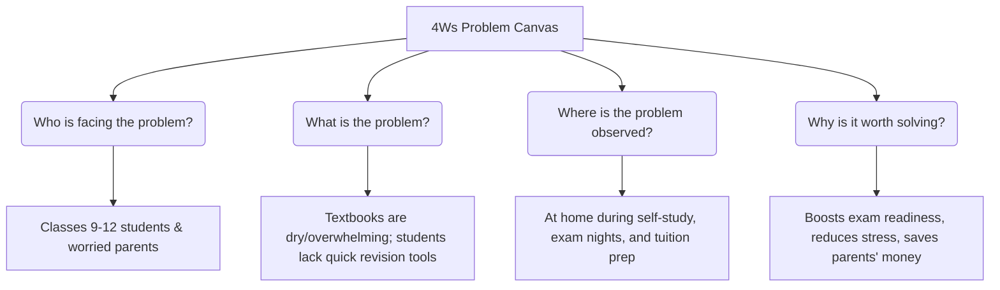
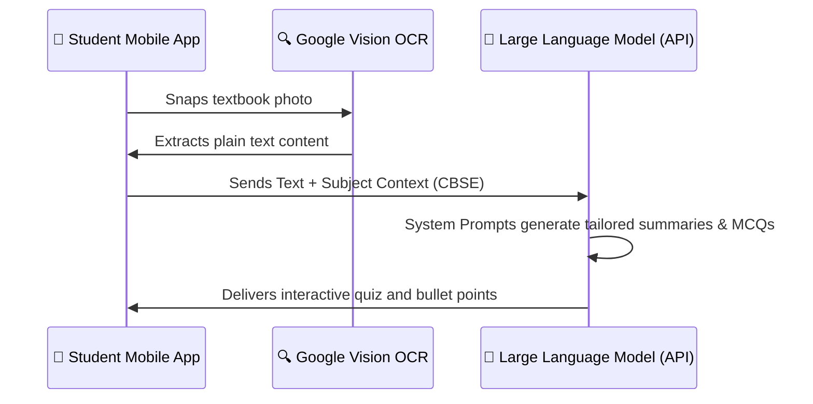

# CBSE CLASS 10 AI INTERNAL ASSESSMENT PROJECT REPORT
## TOPIC: MINI STARTUP PLAN
### PROJECT NAME: STUDYBUDDY AI — "Scan Your Textbook. Master Your Exam."

---

## 📋 TABLE OF CONTENTS
1. [Cover Page & Branding](#-cover-page--branding)
2. [Executive Summary](#-executive-summary)
3. [Problem Scoping (The 4Ws Canvas)](#-problem-scoping-the-4ws-canvas)
4. [The Solution & Business Idea](#-the-solution--business-idea)
5. [Market Analysis & Competitive Edge](#-market-analysis--competitive-edge)
6. [Target Audience & User Personas](#-target-audience--user-personas)
7. [Financial & Operational Model (INR ₹)](#-financial--operational-model-inr-)
8. [AI Model & Technology Stack](#-ai-model--technology-stack)
9. [Ethical Concerns & Safety (AI Ethics)](#-ethical-concerns--safety-ai-ethics)
10. [Conclusion & Future Roadmap](#-conclusion--future-roadmap)

---

## 🎨 COVER PAGE & BRANDING

### StudyBuddy AI Brand Assets

Here is the official brand identity designed for **StudyBuddy AI**. It features a modern, clean, and highly professional aesthetic tailored to inspire confidence in both students and parents.

#### 1. Startup Logo
The minimalist logo features a cute, friendly cartoon robot head wearing round glasses and a tiny graduation cap, in an energetic sky blue and sunny yellow palette.


#### 2. Marketing & Advertisement Poster
The promotional poster showcases our unique selling proposition (USP): "Scan Your Textbook. Master Your Exam." using a high-quality visual of magical learning flashcards emerging from a scanned page.


---

## 📝 EXECUTIVE SUMMARY

**StudyBuddy AI** is a mobile-first, AI-powered educational application designed to revolutionize self-study for Indian secondary school students (Classes 9–12) studying under the **CBSE board**. By combining cutting-edge Optical Character Recognition (OCR) with Generative AI (LLMs), StudyBuddy AI simplifies textbook-heavy learning. 

Students can simply snap a picture of any CBSE (NCERT) textbook page, and the app instantly generates:
1. **A clear, bite-sized, bulleted summary** of key terms and concepts.
2. **An interactive 10-question practice quiz** aligned precisely with their CBSE question pattern (MCQs, assertion-reason, and short-answers).

By offering a tailored, distraction-free environment for just **₹99/month**, StudyBuddy AI bridges the gap between massive, generic chatbots (like ChatGPT) and high-cost personal tutoring, empowering students to study smart, anytime and anywhere.

---

## 🔍 PROBLEM SCOPING (THE 4WS CANVAS)

To design an effective Artificial Intelligence solution, we apply the standard **AI Project Cycle - Problem Scoping Canvas (4Ws)**.



### 1. Who? (Stakeholders)
* **Primary Users:** School students in Classes 9 to 12 who need quick, engaging, and clear explanations.
* **Secondary Stakeholders:** Parents who seek affordable, high-quality supplemental learning aids to support their child's academic development.

### 2. What? (The Problem Statement)
* Secondary school textbooks are content-dense and dry. Students struggle to extract critical points during revision.
* When attempting practice questions, students find generic search engine results or AI answers confusing, inaccurate, or unrelated to their specific board syllabus (e.g., CBSE vs. ICSE).
* Parents find commercial home tutors and large EdTech packages extremely expensive (averaging ₹2,000–₹5,000/month).

### 3. Where? (Context & Environment)
* This problem is observed in homes during late-night exam prep, immediate pre-test revision in school buses, and during daily homework cycles.

### 4. Why? (Value Proposition)
* A dedicated study app reduces the cognitive load on students by filtering out fluff.
* Providing board-specific quiz generation helps students practice the *exact* style of questions they will face in examinations, boosting their self-confidence and grades.

---

## 🚀 THE SOLUTION & BUSINESS IDEA

**StudyBuddy AI** is a one-click mobile study assistant. Here is a breakdown of how the product works:

```
[📷 Student Snaps Textbook Photo] 
        │
        ▼ (OCR Engine Processes Text)
[🧠 StudyBuddy AI LLM System]
        │
        ├─► 📝 Generates Bulleted "Cheat Sheets" & Concept Cards
        └─► 📝 Generates a 10-Question Syllabus-Aligned Mock Quiz
```

### Core Features:
* **One-Snap AI Capture:** Students photograph a textbook page. High-accuracy OCR extracts the text even from poor lighting or curved pages.
* **Curriculum-Aware Summaries:** The app doesn't just summarize; it uses system prompts tailored strictly to **CBSE / NCERT** learning outcomes, emphasizing key terms likely to appear in board exams.
* **10-Question Practice Quizzes:** Instantly generates a customized quiz featuring:
  * 5 Multiple Choice Questions (MCQs)
  * 3 Fill-in-the-Blanks/Match the Following
  * 2 Assertion-Reasoning or Short Answer type questions
* **Gamified Revision Dashboard:** Earn XP points, maintain daily streak counters, and view historical progress analytics to make studying fun.

---

## 📊 MARKET ANALYSIS & COMPETITIVE EDGE

### The Problem with Generic AI Chatbots (Why ChatGPT Fails K-12 Students)
While models like ChatGPT or Google Gemini are incredibly powerful, they are not designed for school-aged children:
1. **Prompt Fatigue:** Younger students do not know how to write complex, system-level prompts (e.g., *"Act as a Class 10 CBSE Social Science teacher and explain chapter 3 of Geography in bullet points..."*). A generic query yields generic, long-winded, and often college-level explanations.
2. **Distraction & Safety Risks:** Standard web chatbots expose young minds to unrestricted topics, lacking educational firewalls or parental supervision controls.
3. **No Syllabus Context:** Chatbots do not automatically know whether a concept is inside the current year's rationalized NCERT syllabus, leading to waste of time studying deleted topics.

### Competitive Matrix

| Feature | ChatGPT / Gemini | Traditional EdTech (BYJU'S/PhysicsWallah) | **StudyBuddy AI** |
| :--- | :--- | :--- | :--- |
| **Ease of Use** | Low (requires prompt writing) | Medium (requires navigating long videos) | **High (One-click photo scan)** |
| **Response Time** | Fast | Slow (15–30 min video lectures) | **Instant (under 10 seconds)** |
| **Syllabus Focus** | Very generic global database | Rigid, pre-recorded content | **Dynamic & Board-Tailored** |
| **Affordability** | Free / ₹1,999 per month | ₹1,500 – ₹5,000 per month | **₹99 per month (Premium)** |
| **Practice Exams** | No structured layout | Standardized static question banks | **Hyper-personalized to page** |

---

## 👥 TARGET AUDIENCE & USER PERSONAS

```
┌──────────────────────────────────────┐     ┌──────────────────────────────────────┐
│        PERSONA A: THE STUDENT        │     │         PERSONA B: THE PARENT        │
├──────────────────────────────────────┤     ├──────────────────────────────────────┤
│ Name: Priya Sharma (Class 10 Student)│     │ Name: Mr. Rajesh Patel (Service Class)│
│ Need: Quick exam revision guide.    │     │ Need: Affordable quality education.  │
│ Pain: Heavy textbooks, dry details.  │     │ Pain: High tuition bills, no progress│
│ Usage: Snaps photos before tests.    │     │ Action: Pays ₹99/month subscription. │
└──────────────────────────────────────┘     └──────────────────────────────────────┘
```

### 1. Primary Target Audience: School Students (Classes 9–12)
* **Characteristics:** Digital natives, high screen time, short attention spans, face immense stress due to upcoming board examinations.
* **Goal:** Wants to understand concepts in 3 minutes rather than reading a 30-page chapter.

### 2. Secondary Target Audience: Parents
* **Characteristics:** Anxious about children's academic performance, budget-conscious middle-class households, looking for safe, high-efficacy tools.
* **Goal:** Demands a tool that guarantees active study/retention, rather than passive screen scrolling.

---

## 💰 FINANCIAL & OPERATIONAL MODEL (INR ₹)

StudyBuddy AI operates on a **Freemium Business Model**.
* **Free Tier:** 3 scans per day, standard generic summaries, basic text output.
* **Premium Subscription (StudyBuddy Pro):** Unlimited scans, board-specific styling, PDF exports, advanced 10-question quizzes, text-to-speech audio, and zero advertisements. Priced at an affordable **₹99 per month** (making it accessible to students all across India).

### Realistic Monthly Operational Cost (Estimated for Year 1)
We estimate our operations supporting roughly **10,000 active free users** and **1,000 paying premium subscribers** in Year 1.

| Cost Item | Description | Cost in INR (₹) |
| :--- | :--- | :--- |
| **AI LLM API Fees** | API tokens (Gemini Flash / GPT-4o-mini) for processing queries | ₹25,000 |
| **OCR & Hosting Servers** | Cloud infrastructure on AWS/Google Cloud (databases & hosting) | ₹12,000 |
| **Marketing & Social Media** | Targeted Instagram & YouTube Shorts marketing to student communities | ₹15,000 |
| **Customer Support & Dev** | Maintenance costs, app bug fixes, student support | ₹20,000 |
| **Miscellaneous & Buffer** | Payment gateway transaction fees (2%), unexpected costs | ₹8,000 |
| **TOTAL MONTHLY EXPENSES** | **Fixed + Variable Operational Costs** | **₹80,000** |

### Monthly Profit Calculation (At 1,000 Paying Users)

To determine our net profitability, we use standard business formulas:

$$\text{Gross Revenue} = \text{Paying Users} \times \text{Monthly Subscription Price}$$
$$\text{Net Profit} = \text{Gross Revenue} - \text{Total Monthly Expenses}$$

$$\text{Gross Revenue} = 1,000 \text{ subscribers} \times \text{₹99} = \text{₹99,000 per month}$$
$$\text{Net Profit} = \text{₹99,000} - \text{₹80,000} = \text{₹19,000 per month}$$

### Break-Even Analysis
To find the minimum number of premium subscribers required to cover all operational costs:

$$\text{Break-Even Point} = \frac{\text{Total Monthly Expenses}}{\text{Premium Price}} = \frac{\text{₹80,000}}{\text{₹99}} \approx \mathbf{809 \text{ Subscribers}}$$

> [!NOTE]
> With just **809 premium subscribers**, the business becomes self-sustaining. Scalability is highly favorable because the AI API cost per user scales linearly, while server hosting and maintenance costs remain relatively flat as user volume grows.

---

## 🛠️ AI MODEL & TECHNOLOGY STACK
 
StudyBuddy AI leverages a highly modern, efficient, and lightweight technical pipeline:
 


1. **Frontend Interface:** Built with **Flutter** (for cross-platform Android & iOS responsiveness) or a lightweight responsive **HTML5/JS web dashboard**.
2. **Text Extraction (Data Acquisition):** **Google Cloud Vision OCR API** for converting image inputs to plain text with maximum precision.
3. **AI Inference & Modelling:** **Google Gemini 1.5 Flash API** or **GPT-4o-mini**. These models are selected for their blistering speed (responses in < 2 seconds) and extremely low API token costs, making our ₹99/month subscription highly viable.
4. **Prompt Engineering Layer:** Predefined prompt templates format the output into structured JSON containing exact exam keywords, board-appropriate difficulty levels, and educational guidelines.

---

## ⚖️ ETHICAL CONCERNS & SAFETY (AI ETHICS)

An outstanding Class 10 AI report must address the critical component of **AI Ethics**:

* **Data Privacy (COPPA & DPDP Act compliance):** Children's data is highly sensitive. StudyBuddy AI enforces strict policies:
  * No personal identification information (PII) is sold.
  * Scanned photos are processed on the fly and deleted from servers immediately after OCR text extraction.
* **Academic Integrity:** To prevent students from using the app to cheat on active homework or tests, the app implements a **Homework Mode Policy** where complex step-by-step problem calculations are replaced by conceptual hints rather than direct answers during typical school hours (8 AM to 2 PM).
* **AI Hallucinations & Fact-Checking:** Large Language Models can occasionally hallucinate facts. To prevent incorrect study material, the AI prompts are restricted exclusively to the context of the scanned textbook page. It is not permitted to generate external facts beyond the textbook scope, maintaining high scientific accuracy.

---

## 🏁 CONCLUSION & FUTURE ROADMAP

**StudyBuddy AI** successfully addresses a critical gap in the Indian educational landscape. By making revision instant, customized, interactive, and affordable, it transitions AI technology from a novelty tool into an essential classroom companion.

### Phase 2 Future Additions:
1. **Multilingual Support:** Translating scanned English textbook pages into Hindi, Tamil, Marathi, etc., to support CBSE students who prefer learning key terminology in their native mother tongue.
2. **Speech-to-Study AI Voice Assistant:** Allowing visually impaired students to listen to interactive audio summaries and answer the practice quizzes vocally.
3. **AI Peer Study Groups:** A safe, automated classroom hub where students can invite classmates to compete on custom quizzes generated from their common school syllabus.

---
**Submitted by:** Class 10 Student  
**Subject:** Artificial Intelligence (Subject Code 417)  
**School Session:** 2026-2027  
**Project Rating Goal:** 10 / 10 Marks 🌟
